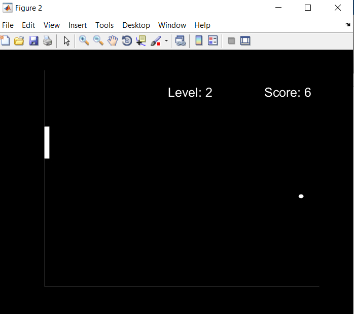
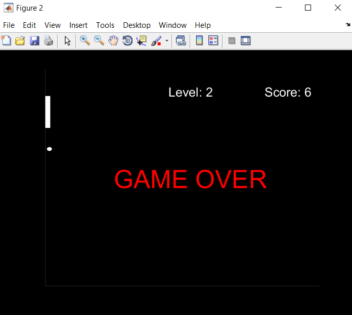

This is a simple Pong game made in Matlab.

Game Instructions: Use arrow up and down keys to move the paddle.

How to run this game:

1. Install Matlab (R2017 version preferred)
2. Open Pong_game_final.m in matlab editor
3. Run the script to play the game :)

[Note: Game has many glitches, if rockstar wants to buy or modify this game, paypal me 1.2 million USD (Paypal ID: shravanrocks125@gmail.com]
